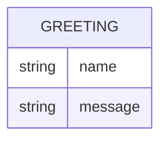

# Domain Model

Greeter has a single, stateless concept: the greeting it produces for a requested name.

`GREETING` is not persisted — it is computed per request from the `name` query parameter (or a default when absent) and returned directly in the response.